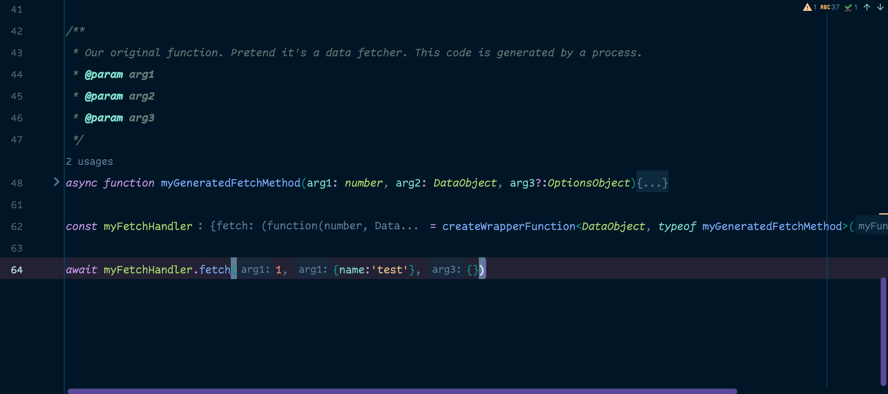

# Bug Reproduction

open up [demoCode.ts](./src/demoCode.ts) in webstorm 2023.2.2 to see that inlay hints for function arguments have a 
weird behavior and are displaying the name of the first argument for the second argument. I have not dug deep enough 
into this to see if it is just the first and second args having issues, or what, but the third argument does seem to
be labeled correctly.

